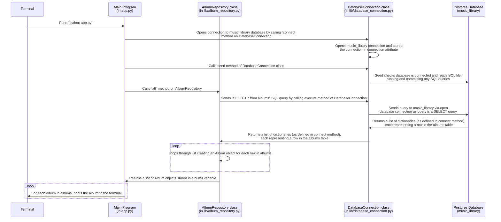

```mermaid
sequenceDiagram
    participant A as Terminal
    participant B as Main Program <br/> (in app.py)
    participant C as AlbumRepository class<br/>(in lib/album_repository.py)
    participant D as DatabaseConnection class<br/>(in lib/database_connection.py)
    participant E as Postgres Database <br/> (music_library)


    A->>B: Runs `python app.py`
    B->>D: Opens connection to music_library database by calling `connect` <br/> method on DatabaseConnection
    D->>D: Opens music_library connection and stores <br/> the connection in connection attribute
    B->>D: Calls seed method of DatabaseConnection class
    D->>E: Seed checks database is connected and reads SQL file, <br/> running and committing any SQL queries
    B->>C: Calls `all` method on AlbumRepository 
    C->>D: Sends "SELECT * from albums" SQL query by calling execute method of DatabaseConnection
    D->>E: Sends query to music_library via open <br/> database connection as query is a SELECT query
    E->>D: Returns a list of dictionaries (as defined in connect method), <br/> each representing a row in the albums table
    D->>C: Returns a list of dictionaries (as defined in connect method), <br/> each representing a row in the albums table
    loop 
        C->>C: Loops through list creating an Album object for each row in albums
    end
    C->>B: Returns a list of Album objects stored in albums variable
    loop
        B->>A: For each album in albums, prints the album to the terminal
    end
```
